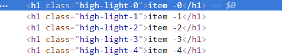
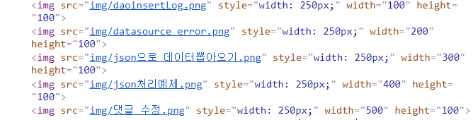
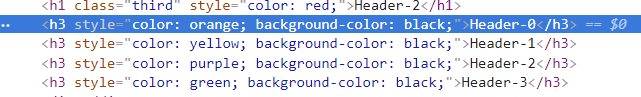

JQuery
===
* ### 공부방향
  * Javascript로 기본 문법등을 익히고 Jquery에서는 가장 활용도가 많은 이벤트 처리와 JQuery에서 지원하는 plug-in을 사용함으로서 좀더 숙달되게 사용할수 있는 개발자가 되기위한 연습 과정
  * JQuery는 홈페이지만 들어가도 알겠지만 어떠한 객체를쓰고 메소드를 쓰던지 "쉽게"라는 말이 꼭들어간다. 그만큼 JavaScript보다 훨씬 쉽게 동적처리를 쉽게 처리했다. JavaScript를 조금이나마 보았으면 쉽게 익힐수 있을 거라 생각된다.
  * JQuery도 마찬가지로 w3schools.com 에서 연습할수 있다.
---
* ### 기본(Basic)
  * #### $(document).ready()  (basic.jsp)
    * 정의: 문서가 준비되면 매개변수로 넣은 콜백함수를 실행하라는 의미.
    * JavaScript에서 window.onload = function() 의 의미와 비슷하다.
  * #### 기본 선택자
    * **전체 선택자(*) :** 첫번째 매개변수에 바꾸고자하는 속성이름을 넣고 두번째에 스타일 속성값을 넣는다. 즉, 모든선택자가의 태그 value의 color를 red로 바꾼다.

          $(document).ready(function(){
            $('*').css('color','red');
          });
    * **태그 선택자**:HTML의 특정태그를 선택하는 선택자로 태그의 이름을 그냥 사용한다. 다른태그도 바꾸고 싶다면 'h3,p'이런식으로 써도 된다.

          $(document).ready(function(){
            $('h2').css('background-color','blue');
            $('h3').css('background-color','pink');
            $('h3, p').css('color','orange');
          });
    * **아이디 선택자**:특정한 id 속성이 있는 문서 객체를 선택하는 선택자이다.아이디 선택자를 사용할때에는 **#** 을 사용한다.

          $(document).ready(function(){
        		$('#target').css('color','green');
        		$('h2 ,#target2').css('background-color','yellow');
        	});
    * **클래스 선택자**: 아이디 선택자와 비슷한 개념이고 다른것은 #이 아닌 **.** 을 사용한다. 여기서는 h1태그에 class='item'의 속성을 바꾸는 부분이다.

          $(document).ready(function(){
        		$('h1.item').css('color','pink');
        	});
  * #### 자손 선택자와 후손 선택자
    * **자손선택자**: 만약에 body태그 밑에 div태그가 있다면 body태그의 자손인 div태그의 스타일 속성을 바꾸는 함수이다. 여기서 볼것은 **>** 로 자손을 선택하는 것이다.

          $(document).ready(function(){
            $('body > *').css('color','green');
          });
    * **후손 선택자**: 말그대로 후손을 선택하는 것으로 body태그의 *을 한다면 자손태그와는 다르게 body 밑의 모든 태그의 속성을 바꾸는 것이다.

          $(document).ready(function(){
        		$('body *').css('color','yellow');
        	});
  * #### 필터 선택자: 선택자 중에 ":" 기호를 포함하는 선택자(basic2.jsp)
    * **입력 양식 필터 선택자**:input태그의 type속성에 따라서 문서객체를 선택할수 있는 방법 예제에서는 select 태그의 자손인 option 태그에 value값을 보는 예제로서 selcted 외에 여러가지 필터 선택자가 있다.
    <table>
      <tr>
        <th align="center">선택자 형태</th>
        <th align ="center"> 설명</th>
      </tr>
      <tr>
        <td>요소:button</td>
        <td>input 태그 중 type 속성이 button인 문서 객체와 button태그를 선택함</td>
      </tr>
      <tr>
        <td>요소:checkbox</td>
        <td>input 태그 중 type 속성이 checkbox인 문서 객체를 선택함</td>
      </tr>
      <tr>
        <td>요소:file</td>
        <td>input 태그 중 type 속성이 file인 문서 객체를 선택함</td>
      </tr>
      <tr>
        <td>요소:image</td>
        <td>input 태그 중 type 속성이 image인 문서 객체를 선택함</td>
      </tr>
      <tr>
        <td>요소:password</td>
        <td>input 태그 중 type 속성이 password인 문서 객체를 선택함</td>
      </tr>
      <tr>
        <td>요소:radio</td>
        <td>input 태그 중 type 속성이 radio인 문서 객체를 선택함</td>
      </tr>
      <tr>
        <td>요소:reset</td>
        <td>input 태그 중 type 속성이 reset인 문서 객체를 선택함</td>
      </tr>
      <tr>
        <td>요소:submit</td>
        <td>input 태그 중 type 속성이 text인 문서 객체를 선택함</td>
      </tr>

      <tr>
        <td>요소:text</td>
        <td>input 태그 중 type 속성이 text인 문서 객체를 선택함</td>
      </tr>
      <tr>
        <td>요소:checked</td>
        <td>체크되어 있는 입력양식을 선택한다.</td>
      </tr>
      <tr>
        <td>요소:disabled</td>
        <td>비활성화된 입력 양식을 선택한다.</td>
      </tr>
      <tr>
        <td>요소:enabled</td>
        <td>활성화된 입력 양식을 선택한다.</td>
      </tr>
      <tr>
        <td>요소:focus</td>
        <td>초점이 맞추어져 있는 입력양식을 선택한다.</td>
      </tr>
      <tr>
        <td>요소:input</td>
        <td>모든 입력양식을 선택한다(input,textarea,select,button)</td>
      </tr>
      <tr>
        <td>요소:selected</td>
        <td>option 객체중 선택된 태그를 선택한다.</td>
      </tr>

    </table>

          $(document).ready(function(){
            setTimeout(function(){
            var value = $('select>option:selected').val();

            alert(value);
            },5000);
          });
          <select>
            <option>Apple</option>
            <option>Banana</option>
            <option>Tomato</option>
            <option>Grape</option>
          </select>

          $(document).ready(function(){
            setTimeout(function(){
              var value1 = $('input:input').val();
              $('input:focus').css('background-color','green');
              alert(value1)
            },6000);
          });
      예제에서 처럼 val()메서드에 매개변수에 아무값도 넣지 않으면 입력양식의 value속성을 알아낼수 있다.
      많이 사용하는 것은 알아놓고 잘 생각이 안날때는 w3schools.com 에서 검색해서 그때그때마다 필요한것을 가져다쓰면 된다. 그러니 무엇이 있는지는 알고 있어야 검색할때 편할 것이다.

    * **위치 필터 선택자**: 말그대로 해당위치를 선택할 수 있다.
      <table>
        <tr>
          <th align="center">선택자 형태</th>
          <th align ="center"> 설명</th>
        </tr>
        <tr>
          <td>요소:odd</td>
          <td>홀수 번재에 위치한 문서객체를 선택할수 있다.</td>
        </tr>
        <tr>
          <td>요소:even</td>
          <td>짝수번째 위치한 문서객체를 선택할수 있다.</td>
        </tr>
        <tr>
          <td>요소:first</td>
          <td>첫번재에 위치한 문서객체를 선택할수 있다.</td>
        </tr>
        <tr>
          <td>요소:last</td>
          <td>마지막에 위치한 문서객체를 선택할수 있다.</td>
        </tr>

        $(document).ready(function(){
      		$('tr:odd').css('background-color','red');
      		$('tr:even').css('background-color','blue');
      		$('tr:first').css('background-color','green');
      	});
        <table>
      		<tr>
      			<th>이름</th>
      			<th>혈액형</th>
      			<th>지역</th>
      		</tr>
      		<tr>
      			<td>강민수</td>
      			<td>에이비형</td>
      			<td>서울시 송파구1</td>
      		</tr>
      		<tr>
      			<td>강민수1</td>
      			<td>오형</td>
      			<td>서울시 송파구2</td>
      		</tr>
      		<tr>
      			<td>강민수2</td>
      			<td>에이형</td>
      			<td>서울시 송파구3</td>
      		</tr>
      		<tr>
      			<td>강민수3</td>
      			<td>비형</td>
      			<td>서울시 송파구4</td>
      		</tr>
      		<tr>
      			<td>강민수4</td>
      			<td>에이비형</td>
      			<td>서울시 송파구5</td>
      		</tr>
      		<tr>
      			<td>강민수5</td>
      			<td>에이비형</td>
      			<td>서울시 송파구6</td>
      		</tr>
      	</table>
      테이블에서 해당 위치에 해당하는 부분의 style을 바꿀수도 있다.

  * #### 배열관리: JQuery로 배열을 관리 할대는 each() 메소드를 사용한다. each()메서드는 매개변수로 입력한 함수로 for in 반복문처럼 객체나 배열의 요소를 검사하는 메서드이다.
    * **JavaScript 배열관리**:each()메서드를 보게 되면 파라미터의 첫번째에는 배열을 넣고 두번째 파라미터에는 index와 item을 갖는 함수를 넣는것을 볼수 있는데 index는 해당 객체의 키값, item은 해당 키값이 가지고 있는 값을 의미하게 된다.
    쉽게 말하자면 해당 배열을 불러와서 html문서로 만들어서body에 넣은것이다.자바스크립트에서 innerHTML에 대해 언급했으니 따로 안함.

          $(document).ready(function(){
        		var array = [
        			{name:'naver', link:'http://naver.com'},
        			{name:'daum', link:'http://daum.com'},
        			{name:'nate', link:'http://nate.com'},
        			{name:'w3school', link:'https://www.w3schools.com/'}
        		];
        		$.each(array,function(index,item){
        			//변수 선언
        			 output ='';
        			//문자열 만들기
        			output += '<a href = "'+ item.link +'">';
        			output += '<h1>' +item.name+'</h>'
        			output += '</a>'

        			//집어넣기
        			document.body.innerHTML += output;
        		});
        	});

    * **Jquery 배열관리**:JQuery의 배열 객체는 따로 만드는 것이 아니라 선택자로 여러개의 문서 객체를 선택할 때 생성된다.
    여기서 **addClass()** 는 문서객체에 class속성을 넣는 것이다. F12를 눌러서 상태를 보면  클래스 속성이 추가된 것을 볼수 있다. 반대로 **removeClass()** 하면 class속성을 제거한다.
    

          
          
          <body>
          <h1>item -0</h1>
          <h1>item -1</h1>
          <h1>item -2</h1>
          <h1>item -3</h1>
          <h1>item -4</h1>
          </body>
  * #### 객체 확장($.extend)
    * **기존의 방식:** 기존방식도 적은수의 속성을 추가할 때는 문제가 없습니다. 하지만 많아지면 매우 귀찮아지기때문에 해결하고 자 나온것이 $.extend() 메소드이다.

          $(document).ready(function(){
        		var object ={}
        		object.name = 'jaehun';
        		object.gender = 'man';
        		object.address ='서울시 ';
        		object.age =36;

        		var output ='';

        		$.each(object,function(key,value){
        			output += key +":"+value+"\n";
        		});
        		alert(output)
        	});
    * **extend 방식:** $.extend()를 사용하면 extend의 두번째 매개변수에 입력한 객체의 속성이 object 객체에 합쳐진 것을 볼수 있음.

          $(document).ready(function(){
        		var object ={name : 'jaehun'};

        		$.extend(object,{
        			gender :'men',
        			address:'서울시',
        			age :36
        		});
        		$.each(object,function(key,value){
        			output += key +":"+value+"\n";
        		});
        		alert(output);
        	});

  * #### jQuery 충돌방지
    * 여러 플러그인을 함깨 사용할때 플러그인 들간의 충돌이 발생할수 있기때문에 충돌을 방지하는 메소드가 필요할때가 있다. 쓰는 방법은 막기 위해서 $.noConflict() 함수를 써서 JQuery식별자를 쓸수가 없게 한다.

          
---
* ### 문서객체 선택과 탐색(dm_select_search.jsp)
  * #### 기본 필터 메서드(filter)
    * filter() 메서드는 두가지 형태로 쓰인다.
      * $(selector).filter(selector)
      * $(selector).filter(function(){})
    * 전 단계에서 :를 사용해서 filter를 사용했는데 여기서는 filter메소드를 사용해보는 것으로 filter메소드를 사용하면 원하는 문서객체의 대부분을 선택할수 있다.
    * function의 매개변수에 index는 $.each(index,value)에서 했었던 index값을 쉽게 뽑아올수 있다. 대부분의 JQuery의 메소드에는 이기능이 있다.
    * h3태그에서 3으로 나누어서 나머지가 0인 객체의 css를 바꾸는 소스이다.

          $(document).ready(function(){
            $('h3').filter(function(index){
              return index %3 ==0;;
              }).css({
                backgroundColor:'black',
                color:'white'
            });
          });
          <body>
            <h3> Header-0</h3>
            <h3> Header-1</h3>
            <h3> Header-2</h3>
            <h3> Header-3</h3>
            <h3> Header-4</h3>
            <h3> Header-5</h3>
          <body>

  * #### 특정 위치의 문서 객체를 선택 , 문서객체 추가(.add())
    * 문서 객체 추가
      * eq():특정위치에 존재하는  문서객체를 선택한다.
      * first():첫번째에 위치하는 문서 객체를 선택
      * last(): 마지막에 위치하는 문서객체를 선택
    * 문서 객체 특징판별(.is()) :문서객체의 특징을 판별한다.
    * 특별하게 볼것은 없다 . eq(0),eq(1)은 쉽게 말하면 배열에서 인덱스 0번째 1번째 와 같은 의미라고 생각하면된다.
    * add()의 경우는 문서 객체를 추가적으로 선택하는 메소드이다.

          $(document).ready(function(){
            $('h1').eq(0).css('background-color','orange');
            $('h1').eq(-1).css('background-color','red');
            $('h1').eq(1).css('background','green').add('h2').css('color','yellow');

            $('h1').each(function(){
              if($(this).is('.select')){
                $(this).css('background','pink');
              }
            });
          });
          <body>
            <h1 class = 'select'>Header-0</h1>
            <h1>Header-1</h1>
            <h2>Header-3</h2>
            <h1 class = 'select'>Header-2</h1>
            <h2>Header-4</h2>
          </body>
  * #### 특정 태그를 선택(.find())
    * 일반 선택자로 선택할수도 있지만 xml 문서에서 데이터를 추출하는데 find()메소드를 많이 사용하게 된다.
    * 코드를 해석해보면 순서는
      1.xml 객체를 parseXML로  파싱해서 xmlDoc 객체에 담는다
      2.xml파일에서 friend라는 태그를 반복문을 통해서 모두 찾는다.
      3.this = xmlDoc 객체를 의미하고 find 태그에서 name 과 language 태그의 text를 찾아서 html객체로 만들어 body에 뿌려준다.
    * $.parseXML : 문자열을 XML로 문서객체로 변경한다. 인터넷 브라우저에서는 문제가 발생할수 있기대문에 파싱을 해주는 것이 좋다.

          var xml = '';
        	xml += '<friends>';
        	xml +='   <friend>';
        	xml +='      <name>재훈</name>';
        	xml +='      <language>Java</language>'
        	xml +='   </friend>';
        	xml +='   <friend>';
        	xml +='      <name>영서</name>';
        	xml +='      <language>JavaScript</language>'
        	xml +='   </friend>';
        	xml +='   <friend>';
        	xml +='      <name>주한</name>';
        	xml +='      <language>C</language>'
        	xml +='   </friend>';
        	xml += '</friends>';

          $(document).ready(function(){
        		var xmlDoc = $.parseXML(xml);
        		$(xmlDoc).find('friend').each(function(index){

        		var output = '';
        		output += '
';
        		output +='   <h1>'+$(this).find('name').text()+'</h1>';
        		output +='   
'+$(this).find('language').text()+'
';
        		output += '
'

        		document.body.innerHTML +=output;
        		});
        	});
---
* ### 문서 객체 조작(document_control.jsp)  
  * #### 문서 객체의 클래스 속성 추가:addClass()
    * h1태그안에 class속성이 추가 된다.

          < script >
          $(document).ready(function(){
        		$('h1').addClass(function(index){
        			return 'class'+index;
        		});
        	});
          < /script >
          < body >
            < h1 >Header-0< /h1 >
            < h1 >Header-1< /h1 >
            < h1 >Header-2< /h1 >
          < /body >

  * #### 문서 객체의 클래스 속성 제거:removeClass()
    * h2 태그안의 class속성을 제거 한다. 그런데 여기서 중요한건 class속성안의 값이 사라지는거지 class가 사라지는 것은 아니다 . 즉 이 코드를 실행해 보면 결과는
    < h2 class > 이런식으로 남아있지 < h2 >로 되어있지 않는걸 볼수 있다

          <script>
            $(document).ready(function(){
        		$('h2').removeClass('a');
            });
          <script>
          <body>
          <h2 class='a'>Header-0</h2>
          <h2 class='b'>Header-1</h2>
          <h2 class='c'>Header-2</h2>
          <body>
  * #### 문서 객체의 속성 알아보기: attr()
    * 로직은 간단하지만 하나 알아보고 넘어갈것이 있다. 여기서 보면 여러개의 문서객체를 선택했는데 첫번째 위치의 문서객체의 값만 반환한것을 볼수 있다. 다음 알아볼 text()의 경우와는 다르게 대부분의 **JQuery객체는 첫번째 위치의 한문서값만 반환하는 경우가 많다.**

    * **attr()메서드는 모든 객체의 속성과 관련된 모든 기능을 수행한다.**

          $(document).ready(function(){
        		var img = $('img').attr('src');

        		alert(img);
        	});

  * #### 문서 객체의 속성 추가하기: attr()
    * 위에서 말했다 시피 객체의 속성과 관련된 것은 모두 attr()메서드가 처리하게 된다.
    * 여기서 속성이라 함은 태그안에 속성을 말한다 즉, 태그안에 type,img.method..등등 이런것을 말한다.
    * 총 3가지 방법이 있다.
      1. $(selector).attr(name,value)
      2. $(selector).attr(name,function(index,attr){})
      3. $(selector).attr(object)
    * 2번째 방법에서 첫번째 매개변수에는 속성이름이 들어가게 되고, 두번째에는 index매개변수를 갖는 함수를 입력하면된다.
    * 3번째 방법은 매개변수에 객체 자체를 넣어서 입력하는 방법이 있다.

              $(document).ready(function(){
            		/* 첫번째 방법 */
            		$('img').attr('width','250');
            		/* 두번째 방법 */
            		$('img').attr('width',function(index){
            			return (index+1)*100;
            		});
            		/* 세번째 방법 */
            		$('img').attr({
            			width:function(index){
            				return (index+1)*100
            			},
            			height:100
            		});
            	});
              <body>
                
                
                
                
                
              </body>

        
  * #### 문서 객체의 속성 추가하기: removeAttr()
    * removeClass()를 사용해서 제거해봤지만 다른점은 전에 언급했다시피 removeAttr()을 사용하면 클래스 속성자체가 모두 삭제가 된다. removeClass()는 여러개의 클래스 속성중 선택적으로 제거할수 있다.

          $(document).ready(function(){
        		$('h2').removeAttr('class');
        	});

  * #### 문서 객체의 스타일 검사: css()
    * attr() 메서드는 문서객체에 속성을 추가하는 모든걸 관여한다면 css()메서드는 스타일에 관한 속성을 보두 관여 한다.

          
          <script>
          $(document).ready(function(){
        		var color = $('h1').css('color');
        		alert(color);
        	});
          <script>

  * #### 문서 객체의 스타일 추가: css()
    * css() 메서드를 이용해서 스타일 추가하는 방법도 attr()처럼 3가지방법이 있고 사용하는 방법도 비슷하다.
      1. $(selector).css(name,value)
      2. $(selector).css(name,function(index,style){})
      3. $(selector).css(object)

              $(document).ready(function(){
            		/* 첫번째 방법 */
            		$('h1').css('color','red');
            		/* 두번째 방법 */
            		var color = ['red','green','blue'];
            		$('h1').css('color',function(index){
            			return color[index];
            		});
            		/* 세번째 방법 */
            		var color = ['orange','yellow','purple','green'];
            		$('h3').css({
            			color:function(index){
            				return color[index];
            			},
            			backgroundColor:'black'
            		});
            	});
              <body>
                <h3>Header-0</h3>
                <h3>Header-1</h3>
                <h3>Header-2</h3>
                <h3>Header-3</h3>
              <body>

          

  * #### 문서 객체의 내부추가: html(),text()
    * 문서 객체의 내부에 내용물을 추가 하고 싶을때 사용하게 된다.
    * 형태는 html(),text()모두 2가지 방법으로 사용된다.
    * 다른점은 **html()메서드는 html태그를 인식하지만 text()메서드는 태그자체도 문자열로 인식해서 그대로 출력하게 된다는 점이다**
      * $(selector).html(value)
      * $(selector).text(value)
      * $(selector).html(function(index,html){})
      * $(selector).text(function(index,text){})
    * html()메서드에서 함수매개변수 두번째값은 원래 있었던 HTML의 내용을 말한다

            $(document).ready(function(){
         		 $('div').html('<h1> Method </h1>'); /* 태그가 적용되어 Method 글자가 h1태그 크기에 맞추어 출력 */
         		 $('div').text('<h2> Method </h2>'); /* 태그를 인식하지 못해서 문자열 그대로 <h2>Method<h2> 그대로 출력 */
         	 });
         		/* 두번째 방법   매개변수를 두개 사용하면 두번째는 원래 있던 HTML의 내용을 의미하게 된다.*/
         	 $(document).ready(function(){
         		$('div').html(function(index){
         			return '<h1>Header -'+index+'</h>';
         		});
         		$('h1').html(function(index,html){
         			return '★'+html+'★';
         		});
         	});
  * #### 문서 객체 제거: remove()
    * first() 함수를 넣어서 첫번째 문서객체만 삭제 하게했음.

          $(document).ready(function(){
          		$('h1').first().remove();
          		$('h3').eq(0).remove();
          });

  * #### 문서 객체 생성: $()
    * $()로 문서를 객체를 생성.text()이나 html()로 문서객체 내부에 추가하고,appendTo로 어디 안에 넣을지 지정

          $(document).ready(function(){
       		   $('<h1><h1>').text('Hello World..!!').appendTo('body');
       		   $('<h1>Hello World</h1>').appendTo('body');
       		   $('').appendTo('body');
          });
  * #### 문서 객체에 문서객체를 삽입
    * 가장 많이 사용하는 것은 appendTo()와 append()메소드를 가장 많이 사용한다.
    * prepend와 After 의 설명을 비교해보면 무엇이 다른지 모른다. prepend가 붙은 것은 바로 뒤에 추가하는 것이고 after,before의 경우는 바로뒤가 아닌 무조건 그냥 뒤나 앞에 붙는단 소리다. 즉 바로 뒤나앞이 아니라는 의미.

      <table>
        <tr>
          <th align="center">메서드 이름</th>
          <th align ="center">설명</th>
            </tr>
            <tr>
              <td>$(A).appendTo(B)</td>
              <td>A를 B의 뒷부분에 추가한다. </td>
            </tr>
            <tr>
              <td>$(A).prependTo(B)</td>
              <td>A를 B의 앞부분에 추가한다 </td>
            </tr>
            <tr>
              <td>$(A).insertAfter(B)</td>
              <td>A를 B뒤에 추가한다. </td>
            </tr>
            <tr>
              <td>$(A).insertBefore(B)</td>
              <td>A를 B의 앞에 추가한다. </td>
            </tr>
            <tr>
              <td>$(A).before(B)</td>
              <td>B를 A의 앞에 추가한다. </td>
            </tr>
            <tr>
              <td>$(A).after(B)</td>
              <td>B를 A의 뒷부분에 추가한다. </td>
            </tr>
            <tr>
              <td>$(A).prepend(B)</td>
              <td> B를 A의 앞부분에 추가한다</td>
            </tr>
            <tr>
              <td>$(A).append(B)</td>
              <td>B를 A의 뒷부분에 추가한다 </td>
            </tr>
    * 예제

          $(document).ready(function(){
            $('<h1><h1>').text('Hello World..!!').appendTo('body');
            $('<h1>Hello World</h1>').appendTo('body');
            $('').appendTo('body');
          });	 
          /* 문서객체에 문서객체를 삽입  */
          /* 첫번재 방식 */
          $(document).ready(function(){
            var h1 = '<h1> ABCDEFG</h1>';
            var h2 = '<h2> ABCDEFG</h2>';

            $('body').append(h1,h2,h1,h2);
          });
          /* 두번째 방식 */
          $(document).ready(function(){
            var content =[
              {name:'재훈',address:'수원시 영통구'},
              {name:'재훈1',address:'수원시 영통구1'},
              {name:'재훈2',address:'수원시 영통구2'}
            ];

            $('div').append(function(index){
              var item = content[index];
              var output ='';
              output += '<h1>' + item.name +'</h1>';
              output += '<h2>' + item.address +'</h2>'

              return output;
            });
          });
  * #### 문서 객체의 이동
    * 문서 객체를 선택하고 문서객체 삽입 메서드를 이용하면 문서객체를 쉽게 다른곳으로 이동시킬수가 있다.

          $(document).ready(function(){
            $('img').css('width',250);

            var Interval=setInterval(function(){
              $('img').first().appendTo('body');
            },2000);
            clearInterval(Interval);
          });
  * #### 문서 객체의 복제:clone()
    * 문서객체의 삽입메서드를 h1태그의 태그와 속성과 텍스트를 추가하고 div 밑에 추가하고 clone()을 이용해서 복사한다.

          $(document).ready(function(){
          $('div').append($('h1').clone());
          });
