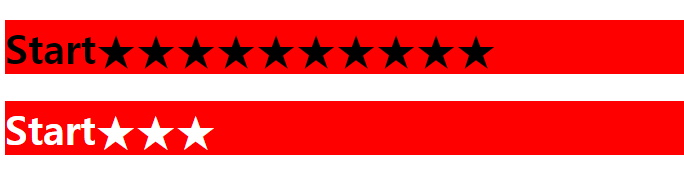
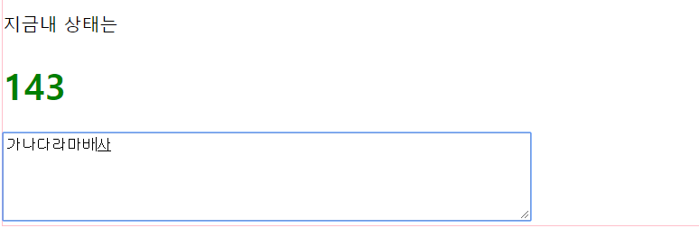
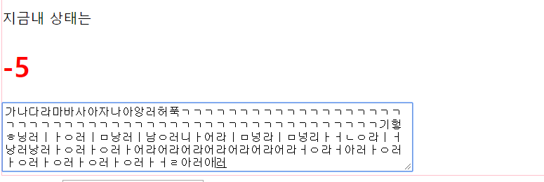

JQuery2
===
* #### 매개변수 context
  * context는 selector가 적용하는 범위를 한정한다. 즉 여기서는 div태그 안의 h1태그와p태그 안의 내용을같이 출력할수 있다.
  * 범위를 이벤트 발생 객체로 한정해서 쉽게 이벤트 발생 객체안에서만 선택자를 적용할수 있다.
  * this는 이벤트 발생객체라고 했다. 따라서 여기서 쓰이는 this도 마찬가지로 this키워드를 $()메서드의 두번째 매개변수로 넣어줘서 이벤트를 한정함.

        $(document).ready(function(){
          //이벤트를 연결 합니다.
          $('div').on('click',function(){
          //변수 선언
            var header = $('h1',this).text();
            var paragraph = $('p',this).text();
            //출력
            alert(header+'\n'+paragraph);
          });
        });
        <body>
          

          <h1>Header-01</h1>
          
paragraph

          

          

          <h1>Header-02</h1>
          
paragraph

          

          

          <h1>Header-03</h1>
          
paragraph

          

        </body>
---

* #### 이벤트 강제 발생:trigger()
  1. $(selector).trigger(eventName)
  2. $(selector).trigger(eventName,data):대부분 data부분에는 배열을 집어넣는다.
  * 3초마다 별이 추가되는 예제인데 여기에다가 trigger()와 last()를 사용해서 강제로 클릭이벤트를 발생시켜서 뒤에 별을 추가할수 있게끔 해보는 예제이다.

          $(document).ready(function(){
            //이벤트 연결
            $('#header').on('click',function(){
              $(this).html(function(index,html){
                return html+'★';
              });
            });
            // 3마다 하나씩 늘리는
            var Interval = setInterval(function(){
              $('#header').last().trigger('click');
          },3000);
          <body>
            <h1 id ='header'>Start</h1>
            <h1 id ='header'>Start</h1>
          </body>
    
---

* #### 기본이벤트와 이벤트 전달
  * preventDefault(): 기본 이벤트를 제거 한다.
  * stopPropagation(): 이벤트 전달을 제거 한다.
  * 예제는 preventDefault를 사용해서 a태그의 기본 이벤트를 제거 하고 스타일에 대한 처리만 하게 했고, 후에 stopPropagation 을 추가해서 이벤트를 전달 못하게끔 막아본 예제이다.
  * 이렇게 두가지를 이벤트를 다 사용하고 싶다면 **return false** 로 하는 간단한 방법도 있다.

        $(document).ready(function(){
          $('h1,a').on('click',function(event){
            $(this).css('background-color','red');
            event.stopPropagation();
            event.preventDefault();
          });
        });
        <body>
          <h1><a href ='http://www.naver.com'>naver</a></h1>
        <body>
---
* #### 이벤트 연결범위 한정(= delegate방식)
  * **일반적인 방식:** 이방식은 click 이벤트를 이용해서 h1태그를 늘리는 예제인데 문제점은 새로 append해서 추가된 h1태그는 클릭하면 아무일도 일어나지 않는 것이다. 그이유는 on()메소드는 현재 존재하는 태그에만 이벤트를 연결하기 때문이다

        $(document).ready(function(){
          //이벤트 연결
          $('h1').on('click',function(){
            var length = $('h1').length;
            var target = $(this).html();
            $('#wrap').append('<h1>'+length+'-'+target+'</h1>');
          });
        });
        <body>
          

            <h1>Header</h1>
          

        </body>

  * **delegate 방식:** delegate방식  두번재 매개변수는 selector역할을 한다. 즉 여기서는 wrap을 클릭했을때 h1이 selector가 된다라는 의미로 해석하면 된다. 그래서 여기서의 this는 위의 일반적인 방법과 다르게 wrap이 this 가 아니라 h1 이 this가 된다.

        $(document).ready(function(){
          //이벤트 연결
          $('#wrap').on('click','h1',function(){
            var length = $('h1').length;
            var target = $(this).html();
            $('#wrap').append('<h1>'+length+'-'+target+'</h1>');
            //이벤트 연결 제거
            $('#wrap').off('click','h1');
          });
        });
---
* #### 마우스 이벤트
  * 자주 사용하는 mouseenter 만 한번써버고 넘어간다. 설명이 좀 얘매할수 있는데 mouseover과 mouseenter의 차이점이라면 mouseenter의 경우는 문서객체의 안에 있는지 외부에 있는지를 따지지만 mouseover는 마우스가 요소의 안으로 완전히 들어와야 이벤트가 발생된다.
  * 대부분 그래서 mouseenter를 많이 사용한다.

    

    <table>
      <tr align ='center'>
        <th> 이벤트이름 </th>
        <th> 설명</th>
      </tr>
      <tr>
        <td> click</td>
        <td>마우스를 클릭할때 발생한다.</td>
      </tr>
      <tr>
        <td> dblclick</td>
        <td>마우스를 더블 클릭할때 발생한다.</td>
      </tr>
      <tr>
        <td> mousedown</td>
        <td>마우스 버튼을 누를때 발생한다.</td>
      </tr>
      <tr>
        <td> mouseup</td>
        <td>마우스 버튼을 땔때 발생한다.</td>
      </tr>
      <tr>
        <td> mouseenter</td>
        <td>마우스가 요소의 경계 외부에서 내부로 이동할때 발생한다.</td>
      </tr>
      <tr>
        <td> mouseleave</td>
        <td>마우스가 요소의 경계 내부에서 외부로 이동할때 발생한다.</td>
      </tr>
      <tr>
        <td> mousemove</td>
        <td>마우스를 움직일때 발생한다.</td>
      </tr>
      <tr>
        <td> mouseout</td>
        <td>마우스가 요소를 벋어날때 발생한다..</td>
      </tr>
      <tr>
        <td> moueseover</td>
        <td>마우스를 요소안에 들어올때 발생한다.</td>
      </tr>
    </table>
    

        $(document).ready(function(){
          $('.inner').mouseenter(function(){
            $('body').append('<h2>mouseenter<h2>');
          });
        });
        <body>
        

         

         

        

        </body>
---
* #### 키보드 이벤트
  * keydown: 키보드를 누룰때 발생한다.
  * keypress: 글자가 입력될때 발생한다.
  * keyup: 키보드를 뗄때 발생한다.
  * 키보드 이벤트가 발생하는 순서
    1. 사용자가 키보드를 입력한다.
    2. keydown 이벤트가 발생한다.
    3. 글자가 입력된다.
    4. keypress 이벤트가 발생한다
    5. 사용자가 키보드에 손을땐다
    6. keyup 이벤트가 발생한다.
  * 따라서 keydown 이벤트가 발생한 순간에는 글이 입력이 되지 않고 keypress나 keyup을 이용해서 글자수를 세야 하는데 keypress의 경우는 태그에 입력을 시작하는 순간부터 50밀리초마다 특정함수를 발생시켜서 처리 할수 있다고 한다. 많이 쓰이기도 하고...하지만 아직까지는 배우는 안계로 keyup을 사용해서 처리해 보았다.
  * **예제:글자수를 세어주는 예**

        $(document).ready(function(){
          $('textarea').keyup(function(){
            //글자수 구하기
            var inputLength = $(this).val().length;
            var remain = 150-inputLength;
            //문서 객체에 입력
            $('#remain').html(remain);
            //글자수 오버 했을때 색깔변경
            if(remain >= 0){
              $('#remain').css('color','green');
            }else{
              $('#remain').css('color','red');
            }
          });
        });
        <body>
          

            
지금내 상태는

            <h1 id = 'remain'> 150</h1>
            <textarea cols='70' rows ='5'></textarea>
          

        </body>

    150자부터 하나씩 줄여나감
    
    150자를 넘겼을대는 - 로증가
    
---
* #### 윈도우 이벤트
  *  필요한것은 그때 마다 검색해보면 된다. 좀 실용적인 것을 해보기 위해서 **무한 스크롤** 에 대한 예제를 해봄
      

      <table>
        <tr align = 'center'>
          <th>이벤트</th>
          <th>설명</th>
        </tr>
        <tr>
          <td>ready</td>
          <td>문서 객체가 준비 완료되면 발생</td>
        </tr>
        <tr>
          <td>load</td>
          <td>윈도(문서 객체)를 불러들일때 발생한다.</td>
        </tr>
        <tr>
          <td>unload</td>
          <td>윈도(문서 객체)를 닫을때 발생한다.</td>
        </tr>
        <tr>
          <td>resize</td>
          <td>윈도의 크기를 변화시킬 때 발생한다.</td>
        </tr>
        <tr>
          <td>scroll</td>
          <td>윈도우를 스크롤 할때 발생한다.</td>
        </tr>
        <tr>
          <td>error</td>
          <td>에러가 있을때 발생한다</td>
        </tr>

      </table>
      

  * **무한 스크롤이란?** 스크롤이 문서 끝까지 내려가면 자동으로 포스트를 추가해 스크롤을 늘리는 방식으로 요즘 많이 쓰는 방식이다.
  * 화면끝까지 스크롤이 도달했다는 것을 인식하게 하기 위해서는 **window객체의 scrollTop 속성와 height 속성을 합한값이 document객체의 높이와 같아져야 한다.**
  이를 사용해서 스크롤이 끝가지 도달했다는 것을 알수 있고 도달했을 때 스크롤이 다시 늘어나는걸 보기 위해서 < h1 > 태그의 문서를 추가해 보았다.

        $(document).ready(function(){
          //스크롤 이벤트 연결
          $(window).scroll(function(){
            //필요한 변수를 구한다.
            var scrollHeight = $(window).scrollTop()+$(window).height();
            var documentHeight = $(document).height();
            //스크롤의 높이와 문서의 높이가 같아질때 처리
            if(scrollHeight == documentHeight){
              for(var i =0; i<10; i++){
                $('<h1>gogogo</h1>').appendTo('body');
              }
            }
          });
        });
        //예제를 만들기 위해서 20개의 h2태그 문서를 만듬
        $(document).ready(function(){
          for(var i =0; i<20; i++){
            $('body').append('<h2>Infinity Scroll</h1>');
          }
        });
---
* #### 입력양식 이벤트
  * 눈에만 익혀두고 이런게 있다는것만 알아두고 나중에 필요할때 검색해서 쓰면된다. 숙달되면 많이 쓰이는 것들이 눈에 들어오고 자동으로 손에 외워질 것이다.
    

    <table>
      <tr>
        <th>이벤트 이름</th>
        <th>설명</th>
      </tr>
      <tr>
        <td>change</td>
        <td>입력 양식의 내용을 변경할때 발생합니다.</td>
      </tr>
      <tr>
        <td>focus</td>
        <td>입력양식에 초점을 맞추면 발생합니다.</td>
      </tr>
      <tr>
        <td>focusin</td>
        <td>입력 양식에 초점이 맞추어지기 바로 전에 발생합니다.</td>
      </tr>
      <tr>
        <td>focusout</td>
        <td>입력양식에 초점이 사라지기 바로 전에 발생합니다.</td>
      </tr>
      <tr>
        <td>blur</td>
        <td>입력 양식에 초점이 사라지면 발생합니다.</td>
      </tr>
      <tr>
        <td>select</td>
        <td>입력양식을 선택할때 발생합니다(input [type='text'] 태그 및 textarea 태그는 제외)</td>
      </tr>
      <tr>
        <td>submit</td>
        <td>submit버튼을 누르면 발생한다.</td>
      </tr>
      <tr>
        <td>reset</td>
        <td>reset버튼을 누루면 발생한다.</td>
      </tr>
    </table>
    

  * **첫번째** 입력양식은 submit에 관한 이벤트에 대한 예제인데 html 태그에서 입력한 값을 받아와서 submit해보는 간단한 예제이고 preventDefault를 한 이유는 눌렀을때 submit 이벤트 처리를 막기위해서 썼다. name과 password에  입력한 값이 있는것을 확인할수 있을 것이다.
  * **두번째** 입력양식은 change 이벤트에 대한 예제로 checked(javascript에서도 써봤징~!)를 했을때 다른 checkbox의 이벤트를 바꾸는 예제를 해보았다.
  실제로 all-check라는 아이디를 가진 태그의 checkbox를 체크했을때 다른 checkbox도 모두 체크가 되는 것을 볼수 있을 것이다.

        //입력양식 이벤트 (1)
        $(document).ready(function(){
          $('#my-form').submit('click',function(event){
            var name = $('#name').val();
            var password =$('#password').val();

            alert(name+':'+password);

            event.preventDefault();
          });
        });

        // 입력양식 이벤트 (2) change 이벤트 사용
        $(document).ready(function(){
          $('#all-check').change(function(){
            if(this.checked){
              $('#check-item').children().prop('checked',true);
            }else{
              $('#check-item').children().prop('checked',false);
            }
          });
        });
        <body>

        <!--입력양식(1)-->

        <form id = 'my-form'>
         <table>
          <tr>
            <td>이름</td>
            <td><input type = 'text' name = 'name' id = 'name'></td>
          </tr>
          <tr>
            <td>비밀버호</td>
            <td><input type = 'password' name = 'password' id = 'password'></td>
          </tr>

          </table>
            <input type = 'submit' value ='제출'>
        </form>

        <!--입력양식 (2)-->

        <input type = 'checkbox' id = 'all-check'/>
        <label>All</label>
        

        <input type = 'checkbox'/>
        <label>A Option</label>
        <input type = 'checkbox'/>
        <label>B Option</label>
        <input type = 'checkbox'/>
        <label>C Option</label>

        

        </body>
